# No-Trade Windows

The platform can block trading during specific time windows defined in the `no_trade` configuration.
This document explains the available fields, dataset masking options, and runtime enforcement.

## Configuration fields

The `no_trade` section is split into two structured blocks:

* `maintenance` – static windows around funding, maintenance, or custom events.
* `dynamic` – runtime guard that can pause trading based on market anomalies.

`NoTradeConfig` keeps backwards-compatible accessors (`funding_buffer_min`,
`daily_utc`, `custom_ms`, `dynamic_guard`), but new configuration files should
prefer the nested structure described below.

### `maintenance` block

| Field | Type | Default | Description |
|------|------|---------|-------------|
| `format` | str | `HH:MM-HH:MM` | Format for entries inside `daily_utc`. Values are stored as `HH:MM-HH:MM` ranges in UTC. |
| `funding_buffer_min` | int | `0` | Minutes before and after funding events (00:00, 08:00, 16:00 UTC) that should be blocked. |
| `daily_utc` | list[str] | `[]` | Daily repeating windows expressed using the format above. Windows should not cross midnight. |
| `custom_ms` | list[dict] | `[]` | One-off windows with explicit start and end timestamps in milliseconds since epoch. |

### `dynamic` block

#### `dynamic.guard` fields

| Field | Type | Default | Description |
|-------|------|---------|-------------|
| `enable` | bool | `false` | Enable the dynamic guard when `true`. |
| `sigma_window` | int or null | `null` | Rolling window (bars) for computing price sigma; guard ignores this trigger when `null`. |
| `atr_window` | int or null | `null` | Rolling window (bars) for ATR-based spread checks; ignored when `null`. |
| `vol_abs` | float or null | `null` | Absolute volatility threshold. Leave `null` to disable. |
| `vol_pctile` | float or null | `null` | Percentile threshold (0-1) for volatility. |
| `spread_abs_bps` | float or null | `null` | Absolute spread threshold in basis points. |
| `spread_pctile` | float or null | `null` | Percentile threshold (0-1) for spread. |
| `log_reason` | bool | `false` | Emit a log entry when the guard blocks trades. |

#### `dynamic.hysteresis`

| Field | Type | Default | Description |
|-------|------|---------|-------------|
| `ratio` | float or null | `null` | Relative buffer before the guard re-enables trading. |
| `cooldown_bars` | int | `0` | Bars to wait after the guard condition clears. |

#### `dynamic.next_bars_block`

Dictionary mapping anomaly reasons to the number of bars that should remain
blocked after the trigger clears (e.g. `{anomaly: 20}`). The map is optional and
defaults to an empty dictionary.

Example YAML (see [`configs/no_trade.yaml`](../configs/no_trade.yaml) for a
ready-to-use template):

```yaml
no_trade:
  maintenance:
    format: "HH:MM-HH:MM"
    funding_buffer_min: 5
    daily_utc:
      - "00:00-00:05"
      - "08:00-08:05"
      - "16:00-16:05"
    custom_ms:
      - {start_ts_ms: 1696118400000, end_ts_ms: 1696122000000}
  dynamic:
    guard:
      enable: false
      sigma_window: 120
      atr_window: 14
      vol_abs: null
      vol_pctile: 0.99
      spread_abs_bps: null
      spread_pctile: 0.99
      log_reason: true
    hysteresis:
      ratio: 0.1
      cooldown_bars: 10
    next_bars_block:
      anomaly: 20
```

## Runtime state file

Online services may persist anomaly-driven windows in `state/no_trade_state.json`.
The file contains an object with a single key `anomaly_block_until_ts` mapping
symbols to UNIX timestamps in milliseconds. Missing or empty files are treated
as `{}` during loading.

```json
{
  "anomaly_block_until_ts": {
    "BTCUSDT": 1696406400000
  }
}
```

## Applying the mask to datasets

`no_trade` windows can be applied to datasets either by **dropping** offending rows, **weighting** them with `train_weight=0`, or exporting a **mask** with the `--mask-only` flag.
Use the `no-trade-mask` CLI (installed with this project) or pass `--no-trade-mode` to training scripts.

```bash
# remove rows
no-trade-mask --data raw.csv --sandbox_config configs/legacy_sandbox.yaml --mode drop

# keep rows but set train_weight=0
no-trade-mask --data raw.csv --sandbox_config configs/legacy_sandbox.yaml --mode weight

# output mask only
no-trade-mask --data raw.csv --sandbox_config configs/legacy_sandbox.yaml --mask-only
```

Effect on a sample dataset:

| ts_ms | price | train_weight |
|-------|-------|--------------|
| 1000  | 1.0   | 1.0 |
| 2000  | 1.2   | 0.0 *(inside no-trade window)* |
| 3000  | 1.1   | 1.0 |

## Runtime enforcement

`TradingEnv` precomputes a mask from the configuration and skips agent actions when the current step falls inside a blocked window.
Runtime metrics expose both the total number of blocked steps and how often the mask fired via `info["no_trade_stats"]` which now
returns `{"total_steps", "blocked_steps", "mask_hits", "policy", "enabled"}`.  When the policy is set to `ignore` the
environment records mask hits without forcing HOLD actions, allowing a "soft" training mode while still surfacing diagnostics
through `info["no_trade_triggered"]`.

```python
from no_trade import compute_no_trade_mask
from no_trade_config import get_no_trade_config
import pandas as pd

cfg = get_no_trade_config("configs/legacy_sandbox.yaml")
df = pd.DataFrame({"ts_ms": [0]})
mask = compute_no_trade_mask(df, sandbox_yaml_path="configs/legacy_sandbox.yaml")

def skip_action():
    pass

if mask.iloc[0]:
    skip_action()  # no orders are sent; step is counted as blocked
```

## Activating the dynamic guard

1. Start from a run configuration that already includes the `no_trade.dynamic.guard`
   block (all templates ship with `enable: false`).
2. Copy the thresholds from [`configs/no_trade.yaml`](../configs/no_trade.yaml) or
   customise them per market.  Conservative defaults use long windows and 99.5th
   percentiles so that the guard only trips in extreme conditions.
3. Flip `enable: true` and, if required, set `log_reason: true` to emit detailed
   reasons when the guard blocks trading.

When enabled, `service_signal_runner` logs the guard state during startup:

```
dynamic guard: enabled sigma_window=180 atr_window=21 vol_abs=0.015 ...
```

Every block generates structured `DROP` log entries with
`{"stage": "WINDOWS", "reason": "DYNAMIC_GUARD", "detail": ...}` so you can
audit why orders were skipped.  The monitoring layer increments the usual
pipeline counters:

* `monitoring.inc_stage(Stage.WINDOWS)` and
  `monitoring.inc_reason("DYNAMIC_GUARD")` contribute to aggregated alerts.
* `pipeline_stage_drop_count{stage="WINDOWS", reason="DYNAMIC_GUARD"}` tracks
  per-symbol drop counts for dashboards.

Offline tooling (`apply_no_trade_mask.py`) also propagates dynamic guard reasons
into the exported mask so dataset jobs can report the same triggers.

## Typical schedule

A common setup blocks short windows around maintenance and funding events.

```mermaid
gantt
dateFormat  HH:mm
axisFormat %H:%M
title No-trade windows example (UTC)
section Maintenance
Daily restart :00:00, 00:05
section Funding buffer
Around funding 1 :07:55, 08:05
Around funding 2 :15:55, 16:05
```



Additional one-off windows can be specified with `custom_ms`:

```yaml
no_trade:
  maintenance:
    custom_ms:
      - {start_ts_ms: 1700000000000, end_ts_ms: 1700001800000}  # 2023-11-14 00:00-00:30 UTC
```

